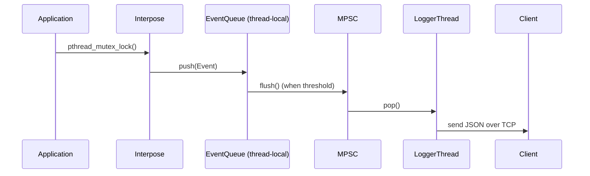

# 🚀 Simple-Threading-Profiler
A lightweight C++ concurrency profiler that interposes `pthread` functions to trace thread and mutex events, detect deadlocks, and stream live data for visualization.

## 📜 Description
**Simple-Threading-Profiler** dynamically intercepts thread and mutex operations (like `pthread_create`, `pthread_mutex_lock`) to record events about concurrency in your application.
It logs operations, detects cycles (potential deadlocks), and can stream the data over TCP to a frontend.
Useful for debugging, profiling, and visualizing multi-threaded applications.

## ⚙️ Tech Stack
* **C++17** — core logic and interposing
* **POSIX pthreads** — target of interception
* **nlohmann/json** — event serialization
* **Custom MPSC queue** — high performance thread-to-logger queue
* **CMake** — build system
* **Client examples** — minimal JavaScript client for TCP logs

## 🗂️ Project Structure
```
.
├── core
│   ├── event         # All event types & serialization
│   ├── interpose     # LD_PRELOAD interposed pthread functions
│   ├── logger        # TCP logger & interface
│   ├── profiler      # Global tracker, MPSC queue, profiler API
│   ├── utils         # Timestamps, helpers
│   └── config.hpp    # Compile-time settings
│
├── tests             # Example multi-threaded tests
├── client.js         # Simple TCP client to receive event stream
├── CMakeLists.txt
└── README.md
```

## 🔍 Components Explanation

### 📌 `MPSCQueue`
* Lock-free Multi-Producer Single-Consumer queue.
* Each local queue flushes events into it, a dedicated logger thread consumes and processes.
* Design Pattern used: Singleton

### 📌 `GlobalTracker`
* Maintains a graph of thread ↔ mutex ownership.
* Detects cycles = **deadlocks** using DFS-based Cycle Detection on a Wait-For Graph, emits special event.
* Design Pattern used: Singleton

### 📌 `EventQueue`
* Each thread keeps a thread-local event queue.
* Periodically flushed into the `MPSCQueue` for central logging.

### 📌 `Logger`
* Consumes the `MPSCQueue`, serializes events to JSON, sends to TCP client.
* Design Pattern used: Composite & Singleton

### 📌 `Interpose`
* Overrides `pthread_create`, `pthread_mutex_lock`, `pthread_mutex_unlock`, etc.
* Captures calls without modifying target source.

## 🔄 Sequence Diagram



## 🚀 How to Compile

Generating Threading Profiler library
```bash
mkdir build && cd build
cmake ..
make
```

Then to run your multi-threaded binary with profiling:
```bash
LD_PRELOAD=./build/libThreadingProfiler.so ./your_program
```

## 💡 Future Work
* ✅ Currently only interposes `pthread_create`, `pthread_join`, `pthread_mutex_lock`, `pthread_mutex_unlock`.
* Plan to add:
  * RWLocks, condition variables, barriers
  * A **GUI (Qt or web)** for real-time graphs, events table, log filtering and CSV generation.
  * Per-thread and per-mutex **duration heatmaps**, not just event timestamps
  * Configurable filters for high-volume programs

## 📝 License
MIT License — see [LICENSE](./LICENSE) for details.

## 🤝 Contributing
PRs and issues are welcome!
Please format with `.clang-format` (Google-based, Allman braces).

## ✅ Example Output
A sample JSON event:

```json
{
  "tid": 12345,
  "timestamp": 17235472545,
  "type": "THREAD_CREATE"
}
```
