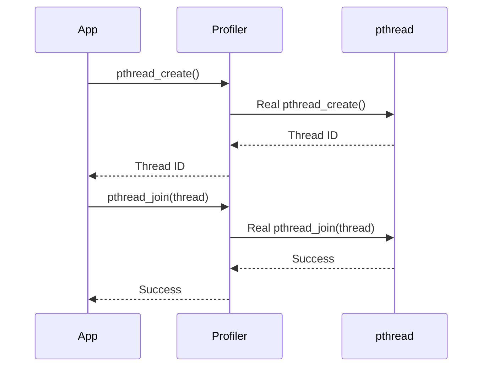
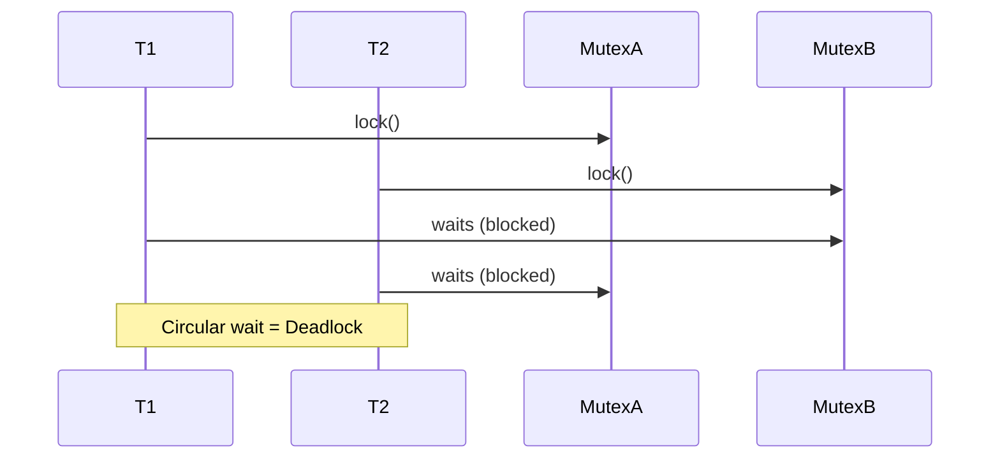

# 🚦 Concurrency-Profiler

## 📄 Description

Threading Profiler is a Linux-based C++ shared library that intercepts `pthread` operations (such as thread creation and joining) to monitor multithreaded applications. It uses `LD_PRELOAD` to inject itself into any target binary at runtime and logs threading behavior, enabling developers to analyze potential issues like excessive thread creation, mismanagement, or even deadlocks. It is accompanied by a simple front-end built with React/Next.js to visualize the results.

## 🛠️ Tech Stack

* **C++**: Core interceptor logic using `pthread` and `dlsym`
* **CMake**: Build system for compiling the shared library and test programs
* **React / Next.js**: Frontend interface for viewing logs or visualizations (future enhancement)
* **Linux**: Uses system-level features like `LD_PRELOAD`

## ✨ Features

* Intercepts `pthread_create` and `pthread_join`
* Logs thread lifecycle events with timestamps
* Easy runtime injection using `LD_PRELOAD`
* Detects potential deadlocks by analyzing unjoined or blocked threads
* Extendable interface for adding logging to mutexes and condition variables
* Lightweight and no code change required in target program

## 🧠 Project Hierarchy

```
Concurrency-Visualizer/
├── ThreadingProfiler/
│   ├── CMakeLists.txt
│   ├── include/
│   │   └── logger.hpp
│   ├── src/
│   │   ├── interpose.cxx
│   │   └── logger.cxx
│   └── build/ *(gitignored)*
├── test/
│   └── test_threads.cpp
├── frontend/ *(React App)*
│   ├── pages/
│   └── components/
└── README.md
```

## 🔁 Sequence Diagram: Normal Thread Calls



## 🧱 Sequence Flow: Deadlock Example



## 🧪 How to Build and Compile

1. **Create the build directory and compile**:

```bash
cd ThreadingProfiler
mkdir -p build && cd build
cmake ..
make
```

2. **Result**: This will generate `libThreadingProfiler.so` inside the `build/` directory.

3. **Build the test binary**:

```bash
g++ -o test_threads ./base_threads.cxx -pthread
```

## 🚀 How to Use the Profiler Library

1. **Preload the shared library**:

```bash
LD_PRELOAD=../ThreadingProfiler/build/libThreadingProfiler.so ./test_threads
```

2. **Output**: You’ll see logging of thread creation and joining printed to `stdout` or a log file if enabled.

3. **Future Plan**: Logs can be routed to a file and visualized via the React frontend.

## 🖼️ Screenshots

*(Screenshots to be added once the frontend visualization is integrated)*

## 📜 License

[MIT License](./LICENSE)

## 🧩 Additional Suggestions

* Add `mutex` and `condvar` interception support
* Frontend timeline visualization
* Thread grouping and duration heatmap
* Log filtering and export to CSV/JSON
